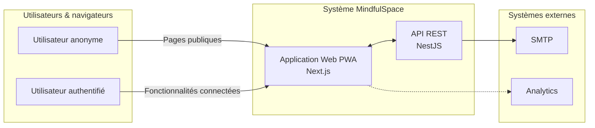

# C1 – Contexte MindfulSpace

```mermaid
flowchart LR
%% Contexte global MindfulSpace

subgraph internet [Utilisateurs & navigateurs]
  userAnon[Utilisateur anonyme]
  userAuth[Utilisateur authentifié]
end

subgraph mindfulSpace [Système MindfulSpace]
  appWeb[Application Web PWA\nNext.js]
  apiSrv[API REST\nNestJS]
end

subgraph externals [Systèmes externes]
  mailSrv[SMTP]
  analyticsSrv[Analytics]
end

userAnon -->|Pages publiques| appWeb
userAuth -->|Fonctionnalités connectées| appWeb
appWeb <--> apiSrv
apiSrv --> mailSrv
appWeb -.-> analyticsSrv
```