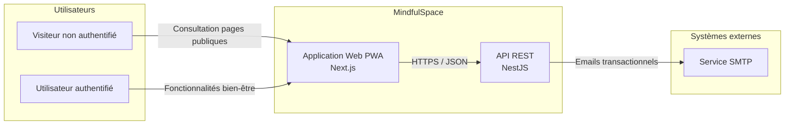

# C1 – Contexte du système MindfulSpace

Ce diagramme présente le **contexte global** de MindfulSpace et ses interactions
avec les utilisateurs et systèmes externes.

```mermaid
flowchart LR

subgraph Users["Utilisateurs"]
  anon[Visiteur non authentifié]
  auth[Utilisateur authentifié]
end

subgraph System["MindfulSpace"]
  front[Application Web PWA\nNext.js]
  api[API REST\nNestJS]
end

subgraph External["Systèmes externes"]
  mail[Service SMTP]
end

anon -->|Consultation pages publiques| front
auth -->|Fonctionnalités bien-être| front

front -->|HTTPS / JSON| api
api -->|Emails transactionnels| mail
```