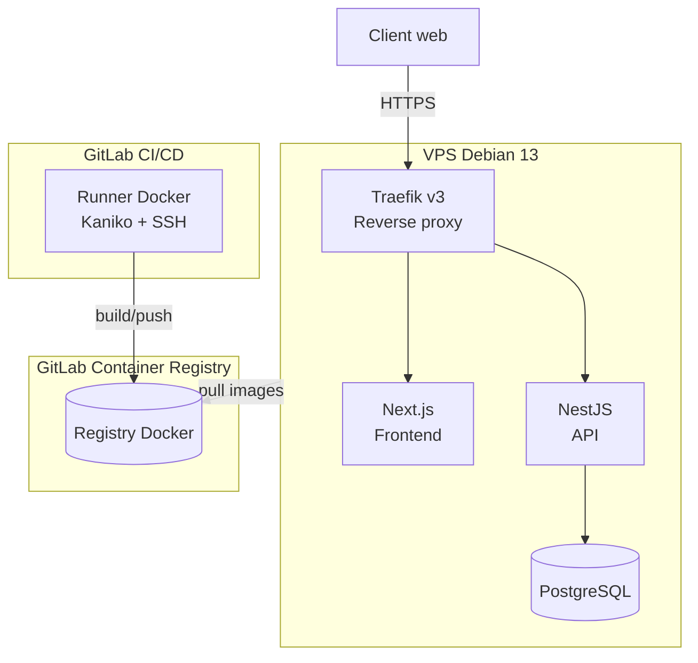

# C2 – Conteneurs MindfulSpace

```mermaid
flowchart TD

client[Client web]

subgraph vps [VPS Debian 13]
  traefik[Traefik v3\nReverse proxy]
  frontend[Next.js\nFrontend]
  backend[NestJS\nAPI]
  postgres[(PostgreSQL)]
end

subgraph cicd [GitLab CI/CD]
  runner[Runner Docker\nKaniko + SSH]
end

subgraph registry [GitLab Container Registry]
  reg[(Registry Docker)]
end

client -->|HTTPS| traefik
traefik --> frontend
traefik --> backend
backend --> postgres

runner -->|build/push| reg
vps -->|pull images| reg
```