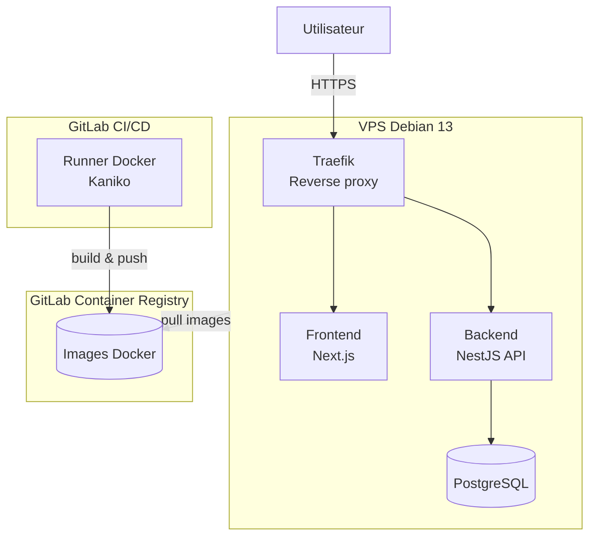

# C2 – Conteneurs et déploiement

Ce diagramme décrit les **conteneurs applicatifs**, leur déploiement
et leur interaction au sein de l’infrastructure.

```mermaid
flowchart TD

user[Utilisateur]

subgraph VPS["VPS Debian 13"]
  traefik[Traefik\nReverse proxy]
  frontend[Frontend\nNext.js]
  backend[Backend\nNestJS API]
  db[(PostgreSQL)]
end

subgraph CI["GitLab CI/CD"]
  runner[Runner Docker\nKaniko]
end

subgraph Registry["GitLab Container Registry"]
  images[(Images Docker)]
end

user -->|HTTPS| traefik
traefik --> frontend
traefik --> backend
backend --> db

runner -->|build & push| images
VPS -->|pull images| images
```