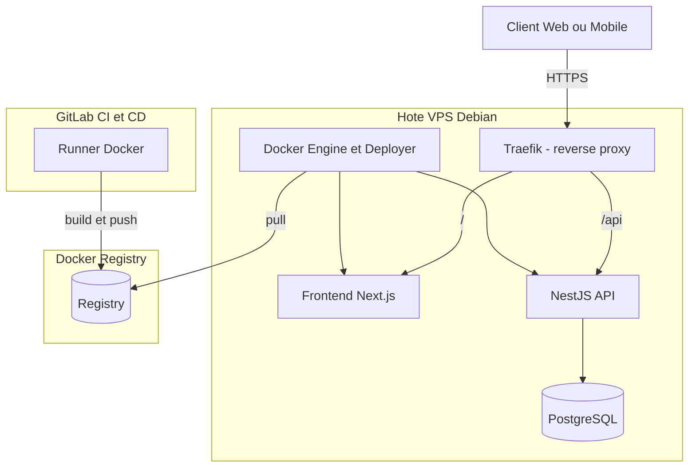

```mermaid
flowchart TD
%% Vue conteneurs MindfulSpace

subgraph vps [Hote VPS Debian]
traefik[Traefik - reverse proxy]
frontend[Frontend Next.js]
backend[NestJS API]
postgres[(PostgreSQL)]
dockerEngine[Docker Engine et Deployer]
end

subgraph cicd [GitLab CI et CD]
runner[Runner Docker]
end

subgraph registry [Docker Registry]
reg[(Registry)]
end

client[Client Web ou Mobile] -->|HTTPS| traefik
traefik -->|/| frontend
traefik -->|/api| backend
backend --> postgres

runner -->|build et push| reg
dockerEngine -->|pull| reg
dockerEngine --> frontend
dockerEngine --> backend
```