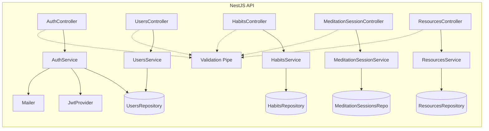

# C3 – Composants API (NestJS)

```mermaid
flowchart LR

subgraph api [NestJS API]
  %% Controllers
  cAuth[AuthController]
  cUsers[UsersController]
  cHabits[HabitsController]
  cMed[MeditationSessionController]
  cRes[ResourcesController]

  %% Services
  sAuth[AuthService]
  sUsers[UsersService]
  sHabits[HabitsService]
  sMed[MeditationSessionService]
  sRes[ResourcesService]

  %% Data (Prisma)
  rUsers[(UsersRepository)]
  rHabits[(HabitsRepository)]
  rMed[(MeditationSessionsRepo)]
  rRes[(ResourcesRepository)]

  %% Infra
  jwt[JwtProvider]
  mail[Mailer]
  validator[Validation Pipe]
end

cAuth --> sAuth --> rUsers
cUsers --> sUsers --> rUsers
cHabits --> sHabits --> rHabits
cMed --> sMed --> rMed
cRes --> sRes --> rRes

sAuth --> jwt
sAuth --> mail

cAuth -.-> validator
cUsers -.-> validator
cHabits -.-> validator
cMed -.-> validator
cRes -.-> validator
```