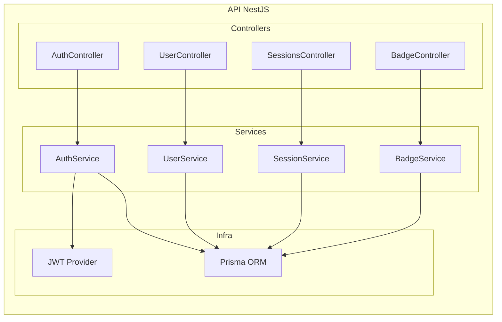

# C3 – Composants Backend (API NestJS)

Ce diagramme détaille la **structure interne de l’API**
selon l’architecture modulaire de NestJS.

```mermaid
flowchart LR

subgraph API["API NestJS"]

  subgraph Controllers
    AuthC[AuthController]
    UserC[UserController]
    DataC[SessionsController]
    BadgeC[BadgeController]
  end

  subgraph Services
    AuthS[AuthService]
    UserS[UserService]
    DataS[SessionService]
    BadgeS[BadgeService]
  end

  subgraph Infra
    JWT[JWT Provider]
    Prisma[Prisma ORM]
  end
end

AuthC --> AuthS
UserC --> UserS
DataC --> DataS
BadgeC --> BadgeS

AuthS --> JWT
AuthS --> Prisma
UserS --> Prisma
DataS --> Prisma
BadgeS --> Prisma
```