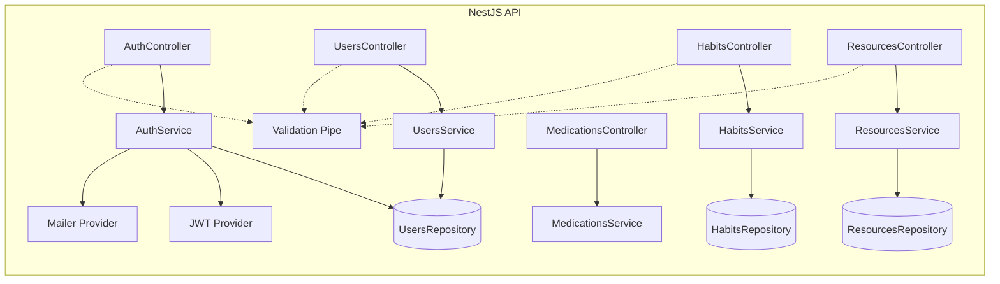

# MindfulSpace – C3 : Composants (API NestJS)

```mermaid
flowchart LR
    subgraph API[NestJS API]
      ControllerAuth[AuthController]
      ControllerUser[UsersController]
      ControllerHabits[HabitsController]
      ControllerMed[MedicationsController]
      ControllerRes[ResourcesController]

      ServiceAuth[AuthService]
      ServiceUser[UsersService]
      ServiceHabits[HabitsService]
      ServiceMed[MedicationsService]
      ServiceRes[ResourcesService]

      RepoUser[(UsersRepository)]
      RepoHabit[(HabitsRepository)]
      RepoRes[(ResourcesRepository)]

      JWT[JWT Provider]
      Mailer[Mailer Provider]
      Validator[Validation Pipe]
    end

    ControllerAuth --> ServiceAuth --> RepoUser
    ControllerUser --> ServiceUser --> RepoUser
    ControllerHabits --> ServiceHabits --> RepoHabit
    ControllerMed --> ServiceMed
    ControllerRes --> ServiceRes --> RepoRes

    ServiceAuth --> JWT
    ServiceAuth --> Mailer
    ControllerAuth -.-> Validator
    ControllerUser -.-> Validator
    ControllerHabits -.-> Validator
    ControllerRes -.-> Validator
```
