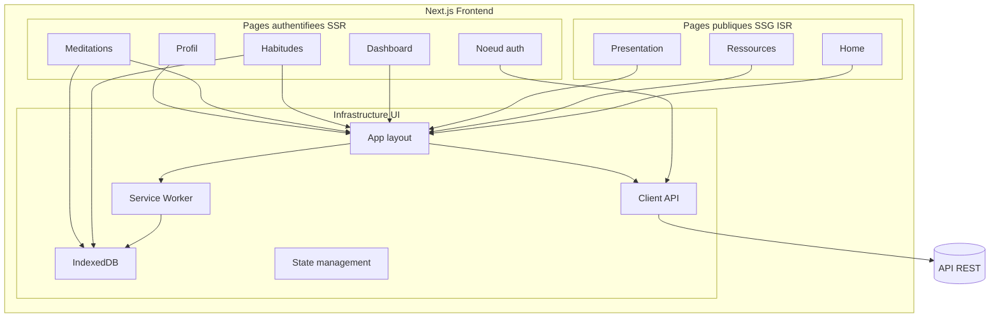

```mermaid
flowchart TD
subgraph front [Next.js Frontend]
subgraph pub [Pages publiques SSG ISR]
home[Home]
docs[Ressources]
about[Presentation]
end

    subgraph auth [Pages authentifiees SSR]
      dashboard[Dashboard]
      habitsUI[Habitudes]
      meditationsUI[Meditations]
      profile[Profil]
      authHub[Noeud auth]
    end

    subgraph infra [Infrastructure UI]
      layout[App layout]
      sw[Service Worker]
      idx[IndexedDB]
      store[State management]
      apiClient[Client API]
    end
end

home --> layout
docs --> layout
about --> layout

dashboard --> layout
habitsUI --> layout
meditationsUI --> layout
profile --> layout

authHub --> apiClient
layout --> apiClient

apiClient --> apiRest[(API REST)]

layout --> sw
sw --> idx
habitsUI --> idx
meditationsUI --> idx
```