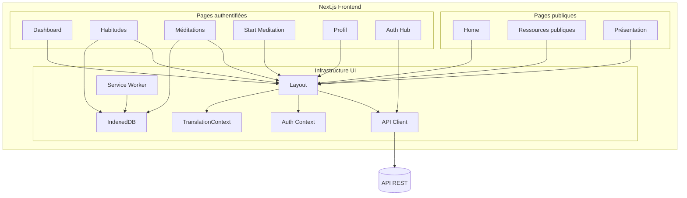

# C3 – Composants Frontend (Next.js)

```mermaid
flowchart TD

subgraph front [Next.js Frontend]

  subgraph pub [Pages publiques]
    home[Home]
    resources[Ressources publiques]
    about[Présentation]
  end

  subgraph auth [Pages authentifiées]
    dashboard[Dashboard]
    habitsUI[Habitudes]
    meditationsUI[Méditations]
    sessionWizard[Start Meditation]
    profile[Profil]
    authHub[Auth Hub]
  end

  subgraph infra [Infrastructure UI]
    layout[Layout]
    apiClient[API Client]
    i18n[TranslationContext]
    sw[Service Worker]
    idx[IndexedDB]
    authCtx[Auth Context]
  end
end

home --> layout
resources --> layout
about --> layout

dashboard --> layout
habitsUI --> layout
meditationsUI --> layout
sessionWizard --> layout
profile --> layout

authHub --> apiClient
layout --> apiClient
layout --> authCtx
layout --> i18n

sw --> idx
habitsUI --> idx
meditationsUI --> idx

apiClient --> api[(API REST)]
```