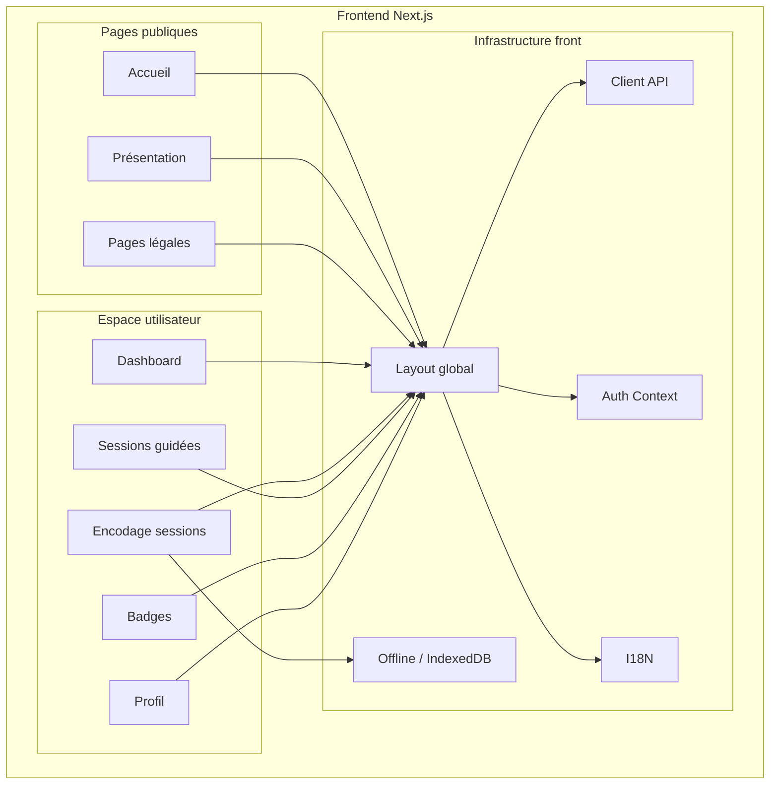

# C3 – Composants Frontend (Next.js)

Ce diagramme présente l’organisation fonctionnelle
du frontend basé sur l’App Router de Next.js.

```mermaid
flowchart TD

subgraph Frontend["Frontend Next.js"]

  subgraph Public["Pages publiques"]
    home[Accueil]
    about[Présentation]
    legal[Pages légales]
  end

  subgraph Private["Espace utilisateur"]
    dashboard[Dashboard]
    encode[Encodage sessions]
    guided[Sessions guidées]
    badges[Badges]
    profile[Profil]
  end

  subgraph Infra["Infrastructure front"]
    layout[Layout global]
    apiClient[Client API]
    authCtx[Auth Context]
    i18n[I18N]
    offline[Offline / IndexedDB]
  end
end

home --> layout
about --> layout
legal --> layout

dashboard --> layout
encode --> layout
guided --> layout
badges --> layout
profile --> layout

layout --> apiClient
layout --> authCtx
layout --> i18n
encode --> offline
```