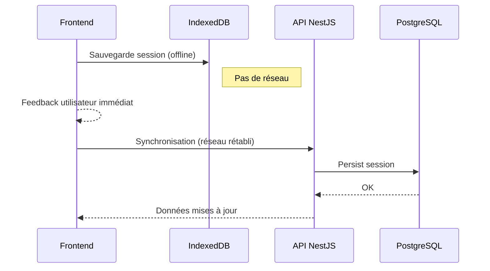

# C4 – Exemple de flux : encodage d’une session (offline-first)

Ce diagramme illustre un **flux métier réel** du projet,
incluant le mode hors ligne.

```mermaid
sequenceDiagram
participant UI as Frontend
participant Cache as IndexedDB
participant API as API NestJS
participant DB as PostgreSQL

UI->>Cache: Sauvegarde session (offline)
Note right of Cache: Pas de réseau

UI-->>UI: Feedback utilisateur immédiat

UI->>API: Synchronisation (réseau rétabli)
API->>DB: Persist session
DB-->>API: OK
API-->>UI: Données mises à jour
```