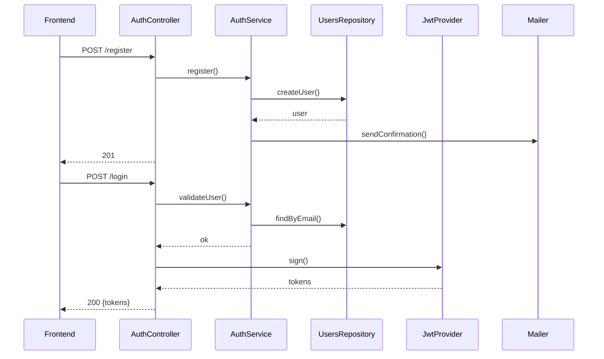

# C4 – Exemple de flux d’authentification

```mermaid
sequenceDiagram
participant UI as Frontend
participant AuthC as AuthController
participant AuthS as AuthService
participant UsersR as UsersRepository
participant JWT as JwtProvider
participant Mail as Mailer

UI->>AuthC: POST /register
AuthC->>AuthS: register()
AuthS->>UsersR: createUser()
UsersR-->>AuthS: user
AuthS->>Mail: sendConfirmation()
AuthC-->>UI: 201

UI->>AuthC: POST /login
AuthC->>AuthS: validateUser()
AuthS->>UsersR: findByEmail()
AuthS-->>AuthC: ok
AuthC->>JWT: sign()
JWT-->>AuthC: tokens
AuthC-->>UI: 200 {tokens}
```