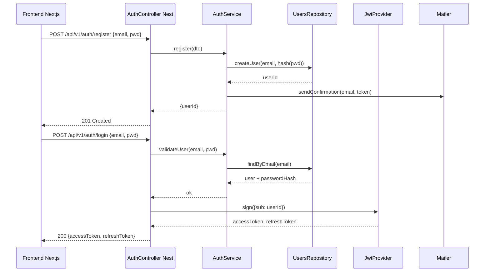

```mermaid
sequenceDiagram
participant UI as Frontend Nextjs
participant AuthC as AuthController Nest
participant AuthS as AuthService
participant UsersR as UsersRepository
participant JWT as JwtProvider
participant Mail as Mailer

UI->>AuthC: POST /api/v1/auth/register {email, pwd}
AuthC->>AuthS: register(dto)
AuthS->>UsersR: createUser(email, hash(pwd))
UsersR-->>AuthS: userId
AuthS->>Mail: sendConfirmation(email, token)
AuthS-->>AuthC: {userId}
AuthC-->>UI: 201 Created

UI->>AuthC: POST /api/v1/auth/login {email, pwd}
AuthC->>AuthS: validateUser(email, pwd)
AuthS->>UsersR: findByEmail(email)
UsersR-->>AuthS: user + passwordHash
AuthS-->>AuthC: ok
AuthC->>JWT: sign({sub: userId})
JWT-->>AuthC: accessToken, refreshToken
AuthC-->>UI: 200 {accessToken, refreshToken}
```